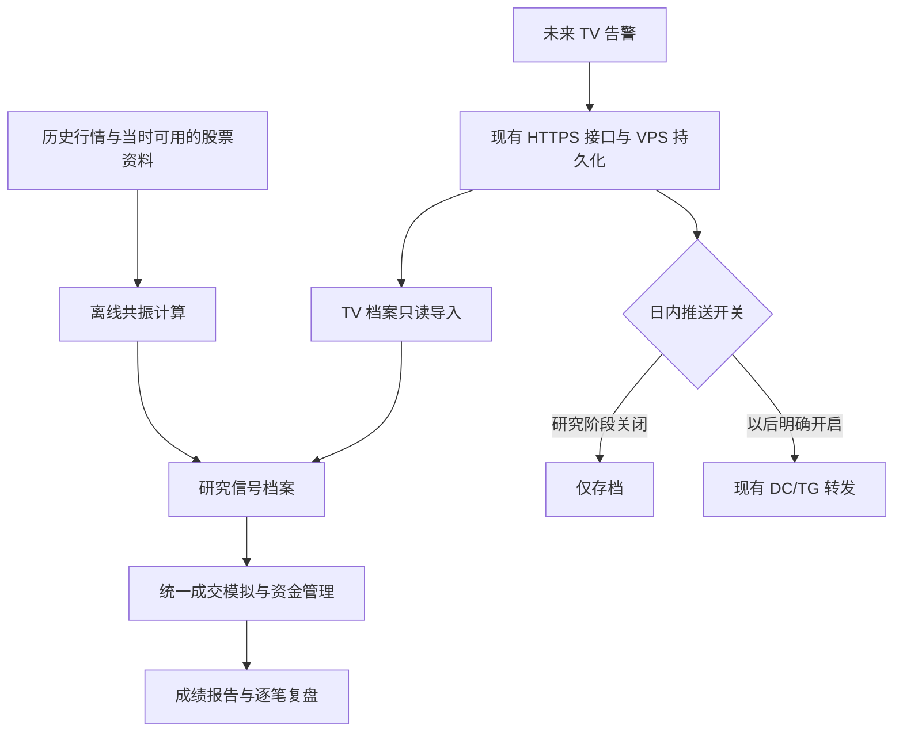

# 日内共振：离线验证与 TradingView 接入方案

日期：2026-09-28。状态：**首版离线引擎、真实行情补采、报价回放和独立网页已实现；尚未完成 TV 同源逐根对照及前向验证**。

目标：先用历史行情检验用户指定的共振买点及退出规则，保存可重放的信号和模拟成交；之后接入 TV 告警，继续使用同一套成绩计算。研究阶段不发送 DC/TG，不连接券商交易接口。

## 已落地的首版与真实样本

入口：`/intraday`，导航「日内研究」。沿用每日复盘主题与 Mantine 控件，提供研究版本切换、基础/双倍成本对照、权益曲线、筛选漏斗、信号及交易分页/搜索、成交证据抽屉、完整 JSON 与全情景逐笔 CSV 下载。原始共振仅做信号诊断，不展示未经筛选的账户成绩。

### 数据与结果（2026-09-28 首次运行）

- 股票池：现有 1000 只候选股票，下载完成 1000/1000，请求失败 0；这是当前池回看历史，存在选池和幸存者偏差。
- 测试：**2026-08-28—2026-09-25，20 个交易日**；Alpaca SIP 原始分钟线，包含 04:00–20:00 ET；盘前入场使用 04:00–09:30 ET。
- 测试期 **6,118,534 根**有效分钟线；另下载 14 个日历日分钟预热，以及测试前 100 个日历日日线，用于前收和前 50 日均量。
- 20,000 个股票日中 15,883 个有盘前记录；其余可能没有成交或数据不足，不补造 K 线。16 只股票起点不足 500 根，达到门槛后才参加。
- 49 只股票有拆并股线索，核验前整只排除。历史 Float 覆盖 **0/1000**；严格版拒绝放行，不能把其零交易看作策略成绩。
- 价格量能版出现 28 次入场、共 69 条事件；只对产生入场的 **11 个股票交易日**补了买卖报价。没有购买新套餐或调用券商交易接口。

模拟起始现金 $10,000，以下均为探索性模拟结果：

| 口径 | 情景 | 已平仓 | 净变化 | 最大观察回撤 | 已平仓胜率 |
| --- | --- | ---: | ---: | ---: | ---: |
| 价格量能 / 分钟近似 | 基础成本 | 23 | -$199.31 | 3.13% | 30.43% |
| 价格量能 / 分钟近似 | 双倍成本 | 23 | -$327.16 | 4.26% | 21.74% |
| 价格量能 / 买卖报价 | 基础成本，延迟 2 秒 | 28 | -$239.59 | 3.58% | 21.43% |
| 价格量能 / 买卖报价 | 双倍成本，延迟 5 秒 | 19 | -$280.45 | 3.64% | 15.79% |
| 严格 Float 筛选 | 缺历史 Float | 0 | 不作评价 | 不作评价 | 不作评价 |

两个报价情景的成交样本不同，所以不能把两者收益差仅归因于手续费。以上都无未平仓；未平仓时权益包括最后可见价格估值，逐笔 CSV 的 `net_realized_usd` 则仅表示已实现部分。当前样本**没有显示盈利优势**，不能据此推断未来，也没有按结果调整门槛。

### 执行与首版边界

- 原共振公式、三根窗口、4/5 根冷却及 WR、RMA 初始化已接入 TypeScript；Pine 源码哈希与参数保存在每次报告中。尚未验证同源 K 线上的 TV 编译和逐根一致性。
- 信号确认后基础延迟 2 秒，压力情景 5 秒；分钟版向上取整到下一可用分钟开盘（因此两种延迟可能落在相同分钟）。报价版必须有下单时点 5 秒内的参考报价，不能以之后的更优报价回填下单参考。
- 报价版入场最多等待 30 秒，价差超过 1% 不开仓；限价保护 0.5%（至少 $0.01），不满足可成交条件就跳过/到期。开仓首笔成交后撤销剩余计划数量；退出可部分成交并继续排队，减仓固定目标为当时持仓的一半。
- 每次成交不超过最近已完成分钟量的 1%，报价模式还限制原始可见挂单数量；报价数量不额外乘 100。无法模拟真实队列优先级、隐藏流动性或交易中断。
- 保护止损按**分钟收盘确认**后发出退出，不模拟逐笔首次触及。分钟模式按后续开盘处理，报价模式按后续可成交 bid 处理，不把止损价当保证成交价。参考止损为入场时最近 8 根最低价。
- 现金 T+1 采用提供的股票交易日日历近似；特殊结算假日尚未核验。单笔 0.25% 是仓位预算，单仓名义上限 20%，最多 2 仓，日内亏损 1% 后停止新开仓，均不构成最大亏损保证。
- 基础成本：每股 $0.005 / 每次最低 $1，另加至少 $0.01 或 0.1% 滑点；研究假设，不声称对应某券商实际费率。
- 本版没有训练/自动优化参数、逐笔首次触及回测、前向样本和新闻验证。下面设计里的未实现阶段仍是后续验收项，不能当作已完成能力。

### 可重复运行

```bash
# 使用现有 Alpaca 凭据；每个命令串行运行，避免同一目录并发写索引。
npm run intraday:lab -- fetch --sessions 20 --end 2026-09-25
npm run intraday:lab -- replay --profile price-volume --fills bars
# 上条输出 run id 后，仅补涉及入场的股票交易日报价：
npm run intraday:lab -- quotes --run <run-id>
npm run intraday:lab -- replay --profile price-volume --fills quotes
npm run intraday:lab -- replay --profile strict --fills bars
npm run intraday:lab -- replay --profile formula-only --fills bars
# 后续 TV 档案原样导入，不能伪造 receivedAt：
npm run intraday:lab -- reconcile --journal <tv-export.json> --profile price-volume --fills quotes
# 导出离线派生结果到网页快照目录；不导出 TV 原始记录和逐笔行情。
npm run intraday:lab -- export --out data/snapshots/intraday
```

可用 `--dataset <dataset-id>` 指定冻结数据集。首个数据集为 `sip-2026-08-28-2026-09-25-77ad45d2fb9d`。命令默认串行手动运行，未增加定时任务，不改变现有日更/推送频率。

### 文件与部署

- 公共参数：`app.config.ts` 的 `intradayResearch`。
- 原始数据、校验清单：`data/intraday-research/datasets/<id>/`，报价：`data/intraday-research/quotes/<id>/`，均为 Git 忽略的本地数据。
- 报告：`data/intraday-research/reports/<run-id>.json/.csv/.html`；只读原始行情，报告按参数、源码、数据、报价校验生成版本 ID。
- 本地页面优先读本地报告；Vercel 只读现有 VPS `/snapshots/intraday/index.json` 及对应 JSON，无需新增业务环境变量。原始行情和密钥不打进函数包。
- 网页预览最多载入前 500 条事件并标明总数，完整 JSON 可下载。导出时同时提供压缩原报告和精简预览，Vercel 优先读取压缩版本。网页部署时先将导出的报告及预览文件复制到 VPS `/var/lib/alpha-agent/market/snapshots/intraday/`，最后原子替换 `index.json`；索引存在但报告尚未到达时页面会明确报错。
- 首批四份报告及压缩预览已同步到 VPS，逐份内容校验一致；预览实测约 1–2 秒返回。网页代码仍需随下一次提交部署上线。
- 新日内推送路由默认关闭。离线引擎不导入任何消息投递器；TV 仍需部署接收端、配置独立密钥并完成真实告警联调。已保存过的路由以 `/push` 配置为准，默认值不会覆盖用户已有设置。

## 1. 总体结构



两种入口共用**规则定义、事件格式、版本和评价标准**。Pine 和 TypeScript 分别运行，不能共用同一份可执行代码；必须用相同输入逐根对照。不同数据源生成的信号保留来源，不强行认定完全一致。

三个运行阶段：

| 阶段 | 信号来源 | 模拟成交 | DC/TG |
| --- | --- | --- | --- |
| 离线研究 | 本地历史行情回放 | 是 | 无发送能力 |
| TV 静默验证 | TV → 现有接收接口 → VPS 档案 | 收盘后评价 | 关闭 |
| TV 提醒 | 同上 | 同一套复盘 | 用户开启后转发新信号 |

离线程序不能导入 `delivery.ts`、Telegram worker 或调用公网 TV Webhook；它不会因网站推送配置改变而发送消息。

## 2. 当前仓库可以复用什么

| 现有内容 | 实际状态 | 本方案的处理 |
| --- | --- | --- |
| `docs/tradingview-intraday-resonance.pine` | 共振、冷却、过滤、模型持仓与告警源码已存在，未完成 TV 编译及真实告警联调 | 作为公式基准，冻结源码哈希；补齐对照用数据窗口输出 |
| `src/lib/intraday/protocol.ts` | `intraday-v1`、信号/交易 ID、字段校验 | 复用原 payload，来源等研究元数据放外层 |
| `src/lib/intraday/store.ts` | TV 原始档案、收件记录、去重、时效判断 | 保留 TV 档案原样；离线档案另存 |
| `src/app/api/tv/intraday/route.ts` | 写盘后响应及管理员导出 | 后续沿用，不新增第二套 TV 接口 |
| `src/lib/intraday/delivery.ts` | 日内专属推送路由 | 静默期禁用该路由，原有 2H/4H 等路由保持原设置 |
| `docs/tradingview-intraday-1000.txt` | 2026-09-28 生成的静态候选池 | 用于初步研究和冻结后的前向验证，不伪装成过去的时点股票池 |
| `src/lib/data-sources/alpaca.ts` | 当前仅支持 1Day/30Min/1Hour，盘中转换函数会排除盘前盘后；可能回落 IEX | 新增研究读取器，固定 SIP，支持 Extended 1Min/5Min；不改变旧行情任务的时段和回落行为 |
| `src/lib/backtest/engine.ts` | 现有轮动体系，交易周期为 1d/4h/2h/1h | 参考缓存和统计方式，不复用其交易条件 |

现有日内代码还没有本轮生产部署确认。尤其 `defaultPushRoutes()` 当前把 `signal-intraday` 默认开启：**首次静默接入前必须改为默认关闭，并检查 VPS 上已保存的该路由也关闭**。仅改默认值不会覆盖已保存配置。

## 3. 首轮范围与结果的名称

首轮取 **20 个已结束的美股交易日**做工程验证。先用少量股票打通链路，再扩大到 1000 只；不是先挑盈利股票。所有运行保存开始前确定的日期、名单和配置。

分开输出三种口径：

| 口径 | 条件 | 能说明什么 |
| --- | --- | --- |
| `formula-only` | 仅共振与模型退出，关闭股票过滤 | 校验公式、时序和原始信号；不是完整策略成绩 |
| `price-volume` | 共振 + 价格 + 当时涨幅 + 当时累计量；明确不使用 Float | 在缺少历史 Float 时研究这一个变体 |
| `strict` | 上述条件 + 信号当时可用的 Float < 2000 万股 | 完整现行过滤；Float 不明则拒绝入场并计入缺失统计 |

不能把 `price-volume` 报告命名为完整低流通盘策略回测。严格模式交易很少或为零时，分别列出数据不足、过滤失败和没有共振的数量，不临时放宽门槛制造成绩。

现有 Pine 只有整体开关 `useScanner`，没有“只关闭 Float”的输入。因此 `price-volume` 是明确标记的离线研究变体，须把 `filterProfile` 写入参数及策略身份；不能宣称与当前 TV 完整过滤逐笔等价。同源对照先比较原始共振，完整信号对照使用 `strict` 或双方都关闭过滤的相同模式。

### 股票池偏差

- 现有 1000 只名单使用了截至 2026-09-25 的价格、成交量和振幅；回放该日期之前的行情，报告必须标记 `exploratory_current_universe`，存在选池偏差与幸存者偏差。
- 真正的历史策略验证需补当时的上市/退市、代码变更及可用资料，按每个交易日之前的信息形成股票池；无法重建则明确标注，不以今天的上市目录代替。
- 更容易开展的下一步：在未来目标交易日开始前冻结名单、参数和版本，连续记录之后的新数据。只有冻结之后的交易日可进入该版本的前向验证。
- 调参版本与验证版本分开；参数修改后的验证重新起算，不能把已经看过并据此调参的日期称为未见样本。

## 4. 数据采集与空间控制

### 4.1 数据需求

| 数据 | 用途 | 采集范围 |
| --- | --- | --- |
| 上市目录、交易所、代码变更 | 股票身份与样本边界 | 每个版本冻结；未来保存每日观察快照 |
| 至少 50 个完整交易日日线 | 前收、前 50 日日均量 | 测试开始前预热，并逐日推进；不包含当日最终值 |
| SIP Extended 1 分钟 OHLCV | 共振、冷却、过滤、持仓轨迹 | 首轮连续计算 04:00–20:00 的有效 K 线；只允许 04:00–09:30 入场 |
| 历史买卖报价 | 价差、可执行价格、报价容量、持仓估值 | 候选入场前少量锚点、可能成交窗口及持仓至最终出场全过程 |
| 历史成交明细（精细止损需要） | 定位第一次成交价触及止损的时间 | 只补相关持仓区间；缺失则降低结果精度标签 |
| Float 的值和可获得时间 | 严格小流通盘过滤 | 需要 `effectiveAt` 和 `availableAt`；当前值不能向历史回填 |
| 交易/结算日历、拆并股事件 | 时段、结算、名义价格及股数一致性 | 与回测范围一起冻结 |

已实测现有密钥可以读取样本盘前 SIP 1 分钟历史和历史买卖报价。**这证明入口可用，不代表 1000 只的全部日期都完整。** 每个下载分区必须独立检查覆盖情况。

日均成交量先核对供应商日线是否与 TV 的日线/时段一致；不同口径不可直接混用。必要时从相同日内时段重建并另定版本。在完成对照前，报告标记数据源口径差异。

### 4.2 为什么首轮不能只下载盘前

指标的 EMA/RMA 和冷却状态基于图表连续 K 线。交易窗口结束后，指标仍在计算；不能每天 04:00 重置，也不能删除非候选时段后把不相邻 K 线拼在一起。

- 起点至少补 500 根有效 Extended 1 分钟 K 线作为预热，非 500 个钟表分钟；无有效成交形成的空档不填成虚构 K 线。
- 对 500 / 1000 根预热做收敛和事件一致性检查；不一致则延长。同源对照必须固定输入起点和状态，不能仅凭预热长度宣称与 TV 精确相等。
- 保存检查点所需全部状态：RMA/EMA、滚动窗口、冷却索引、模型交易、当日累计量和日线参考。
- 空数据分别标记为已完成查询但无有效 K 线、停牌已证实、下载失败、历史不足；不能把“接口报错”当作“当天没有交易”。

### 4.3 下载优化的顺序

**先保证连续计算正确，再减少下载。**

1. 首轮基准读取连续分钟数据，按股票和日期分块流式处理，不把整池对象同时放进内存。
2. 缓存按来源、feed、复权方式、symbol/as-of、时段和数据版本区分；失败重试、断点恢复，完成后原子替换。
3. 检验等价后，可用 5 分钟数据定位“可能通过筛选”的日子。例如某根 5 分钟最高价曾达到涨幅门槛，只表示该区间需要补 1 分钟数据，不能把该根结束后才知道的信息当成更早时刻的入场依据。
4. 粗筛必须是候选全集的超集；用完整分钟基准核验没有漏掉合格信号。`formula-only` 模式不应用价格/涨幅粗筛。
5. 候选区间依然要恢复完整指标状态和已有持仓；没有检查点时补齐中间分钟数据。不能只下载买点前几根来计算。
6. 报价和成交明细只给候选模拟交易补采；未成交、超时、缺报价的候选也保留。先收足可能退出区间，不能依据未来盈利选择补采对象。

数据预算：1000 只 × 20 日 × 330 分钟，盘前主体最多约 **660 万根**；连续 Extended 为约 **1920 万根**，另加预热。之前 0.7–1.5 GB 估算只针对盘前主体，完整连续数据未压缩可按约 2–5 GB 做初步磁盘预算，最终以采集样本测量为准；逐笔报价单独统计，不给未经测量的总量承诺。

使用 Node 自带 gzip + JSONL，首版不增加数据库或行情中间件。每批 50–100 个股票、最多 3 个并发请求，完整读取分页；限流依据返回头退避，403 不静默切换 IEX。权限、配额和剩余空间不足时保留进度并显式失败。

### 4.4 复权与时间边界

- 原始行情不可覆盖；价格门槛和成交使用**交易当时的名义价格**。
- 计算跨拆股指标和昨收比较时，按截至当时已生效的拆股关系调整历史窗口；持仓股数和止损同步换算。不能让测试之后的反向拆股改变过去的 $1–20 筛选资格。
- 首版不能可靠处理的公司行动单列为 `corporate_action_unresolved`，不输出看似精确的完整收益；后续补齐后产生新数据版本。
- 内部时间使用 UTC 毫秒，交易日、会话使用 `America/New_York`，遵守夏令时与市场日历；日期范围采用应用层 `[start,end)`，对供应商包含终点的响应去边界重复。

## 5. 共振引擎：规则保持不变

数学细节以已冻结的 [Pine 源码](./tradingview-intraday-resonance.pine) 和 [信号说明](./intraday-signals.md) 为基准。

1. 27 根价格位置经过三层 `ta.rma(...,3)`；TREND 上穿 POWERLINE 且 TREND < 30。
2. 当根及前 2 根存在操盘顾问/长短顾问，形成优质买点；或存在指定资线金叉，形成能量共振。两者同时成立时优质买点优先。
3. `FILTER(X,4)` 表示发出后屏蔽接下来 4 根，第 5 根才可再次触发；屏蔽中的信号不刷新冷却。原始冷却在股票过滤和交易时段筛选前更新，与当前 Pine 一致。
4. 入场、减仓、逃顶使用已完成 1 分钟 K 线。入场止损固定为包括信号根在内最近 8 根最低价；不使用该根收盘以后才出现的数据。
5. 原始减仓/逃顶条件照抄当前公式，不加入新的 MACD、RSI 或新闻门槛。斐波那契仅显示，不参与交易。
6. 当前默认过滤保持 $1–20、较昨收 +20%、当日累计量 / 前 50 日日均量 ≥5、Float <2000 万。这个量比不是同一时刻的相对成交量，不擅自替换。
7. 模型持仓、持有中再次共振 watch、首次 partial、top/stop/session_end、缺行情后 session_gap 都保留当前语义。

原始**信号模型状态**和**模拟账户持仓**必须分离：一条入场信号因价差或资金被拒绝后，不能反过来改变后续原始信号。后续减仓/退出可能对应没有成交的模型交易，应记录为未执行，不伪造仓位。

## 6. 成交和账户模拟

以下是首版建议冻结的**研究参数**，不是已验证的最优值，也不是用户实际账户配置。统一放入 `app.config.ts` 的研究配置，由每次运行完整复制到 manifest。改动任何参数都产生新 run，不覆盖旧成绩。

| 参数 | 首版研究默认值 |
| --- | --- |
| 初始模拟资金 | $10,000 |
| 账户模型 | 不加杠杆，只用已结算现金；卖出款按 T+1 结算日历释放 |
| 单笔预算风险 | 当前权益 0.25%；只是仓位计算预算，不是最大亏损保证 |
| 单只仓位金额上限 | 当前权益 20% |
| 同时持仓 | 最多 2 只；每股整数股，不加仓 |
| 同时未完成入场 | 占用相应现金、名额和风险预算，禁止重复使用 |
| 首次减仓 | 卖出当前模拟持仓 50%，向下取整；剩余仅 1 股则全部卖出 |
| 逃顶/止损/结束会话 | 生成退出意图，按之后可获得的行情尝试成交 |
| 日内停止新开仓 | 已实现 + 可估未实现损益达到日初权益 -1%；现有退出仍处理 |
| 成本基准 | 每次执行意图手续费 max($1, 股数 × $0.005)，分批成交累计计费；另做双倍成本情景。这是统一研究假设，不宣称等于 IBKR 账单 |
| 最大入场价差 | (ask − bid) / mid ≤1%；只过滤开仓，不因此阻止退出 |
| 基础执行延迟 | 信号可用后 2 秒；对照 5 秒和 10 秒 |
| 额外不利滑点 | 在买 ask / 卖 bid 基础上，每股 max($0.01, 价格 × 0.1%)；再做双倍滑点情景 |

只有模拟账户可以给“账户收益率”；独立信号机会集合只给每笔结果和 R 倍数。不能把所有重叠交易的收益相加，声称一个有限资金账户都做到了。

### 6.1 两档成交精度

**A. 分钟 K 线诊断：**

- 信号确认后，从之后的首个有效分钟开盘价加不利成本模拟；不是直接按信号收盘价成交。
- 买入从该根开盘开始生效，同根止损按不利路径处理；若开盘已低于止损，则撤销待开仓并记录原因。
- 已有仓位的跳空止损不得按锁定价保证成交；使用首个可观测价格的保守近似。
- 缺乏分钟内路径、报价和容量，必须标记 `bar_approximation`，用于检查逻辑与敏感性，不作为可执行收益结论。

**B. 报价与成交明细验证：**

- 入场信号收盘后才能下模拟单。离线下单最早时间为 `signalTime + latency`；TV 接收模式则为 `max(signalTime, receivedAt) + latency`，不能收到晚了却按早先的好价格成交。
- 下单价格只参考当时或此前仍有效的报价；成交使用下单后首个合格报价。无报价、价差过宽、报价已过期或无可用数量都不保证成交。
- 盘前按**可成交限价单**建模：买价上限以当时 ask 加设定价格保护计算，候选成交价不得超过限价；超过保护就不成交。开仓订单默认 30 秒到期，不追价。
- 单次成交量还受可见对手盘数量和此前已完成 1 分钟成交量的 1% 限制，按同一股票共享容量；相同报价不能给多个订单重复消费。不使用未来一分钟成交量决定当前能买多少。
- 整个退出区间保留报价和状态；需要精确止损时，以持仓后的首个合格成交价触及锁定价为触发，再按延迟后的 bid 模拟卖出。止损是模拟软件行为，不假设盘前券商保证执行。
- 退出限价未成交仍是持仓：按预先固定的间隔和最新报价尝试调整，保存每次请求；首版建议每 5 秒一次，单次保护幅度固定，停牌/断流期间不成交。到报告终点仍无法平仓则显示未平仓及估值质量，禁止删除该笔。
- 报价模式没有完整盘口深度和排队信息，只能作为更接近执行的估计；不得写成真实成交或保证成交。

所有报价有效期、价格保护、数量限制和退出重试参数，在运行前填写数值并冻结；数据不足不自动变成“按理想价成交”。例如首轮可用报价最长年龄 5 秒、限价保护 0.5%；这些假设必须进入压力测试，不能事后只留下最好情景。

### 6.2 会话边界与资金顺序

- 当前 Pine 在 09:29 这根分钟线收盘时，即 09:30，才确认 `session_end`。之后的模拟成交可能发生在常规交易时段，不能使用还没确认出场时的盘前收盘价。
- 如果以后要求 09:30 之前实际退出，需提前产生退出信号并升级策略版本；不能在回测里暗自提前成交。
- 离线所有股票按全局时间合并；同一时点先处理已有订单/退出，再处理新开仓，稳定并列顺序为优质买点、能量共振、symbol。不能按网络下载返回顺序分配资金。
- 入场仓位取风险预算、现金、单仓金额、对手盘容量等约束的最小整数股数。现金预留包括费用，未完成订单和未结算卖出款不可重复使用。
- 组合资金拒绝、日停工拒绝、流动性拒绝和缺行情拒绝分开统计；不改变原始信号列表。
- 每分钟估值权益并记录最高点到最低点的回撤，不能只用已平仓资金曲线。报价缺失时估值单独标记；不可验证的回撤不包装为完整结果。

## 7. 事件、成交和运行版本

保持 `intraday-v1` payload 不变。现有 schema 是 strict，直接往 TV 消息里加字段会被拒绝；研究元数据使用外层封装：

```typescript
type ResearchEvent = {
  runId: string;
  source: "offline" | "tv";
  engineVersion: string;
  dataVersion: string;
  universeVersion: string;
  parametersHash: string;
  generatedAt: number;
  observedAt: number | null; // TV receivedAt；历史回放不能伪造实际观察时间
  originalSignalId: string; // 复用 signalId(payload)
  payload: IntradaySignal;
};
```

研究主键包含 `runId + source + originalSignalId`，防止离线与 TV 相同公式事件互相覆盖。TV 原收件内容不可修改；只读导入后，离线事件与 TV 事件可以并排比较。

模拟成交另存 `signalId / simulatedTradeId / orderId / requestedAt / filledAt / side / quantity / fillPrice / fees / slippage / reason / dataQuality`。`payload.price` 永远是信号参考价，不能为了让账本对上而改写成成交价。

`manifest.json` 至少记录：

- Git commit **及未提交源码内容哈希**、Pine 哈希、引擎版本；不能只记 commit 而漏掉工作区改动。
- 数据获取时间、供应商、修订版本、分区校验和、价格调整口径、股票身份映射、缺失范围。
- 股票池生成时间、依据窗口、冻结时间、完整名单和对应的样本偏差标签。
- 信号参数、筛选模式、成本、成交、账户参数和稳定排序规则；规范化 JSON 后计算哈希。
- 请求日历、实际有效交易日、预热区间、成绩区间、验证阶段及数据质量。

历史结果不调用 `IntradayStore.accept()`：该接口的 120 秒时效校验及 pending 投递队列属于实时收件语义。不要通过伪造 now 来绕过它。

## 8. 存储、程序入口和配置

### 8.1 首版文件范围

计划新增少量代码文件，不创建新服务：

| 文件 | 职责 |
| --- | --- |
| `scripts/intraday-lab.ts` | 一个 CLI 入口：下载、回放、报价补采、报告、TV 对账 |
| `src/lib/intraday/researchData.ts` | SIP 批量读取、缓存、运行 manifest、TV 只读导入 |
| `src/lib/intraday/resonance.ts` | 纯计算共振、过滤、模型状态和检查点 |
| `src/lib/intraday/simulation.ts` | 模拟订单、数量、费用、结算及组合权益 |
| `src/lib/intraday/report.ts` | 质量检查、指标和 HTML/CSV 输出 |
| `tests/intradayResearch.test.ts` | 数学、时序、成交、隔离和重放测试 |

公开默认配置集中在现有 `app.config.ts`；复用 `scripts/env.ts`、已有 Alpaca 密钥。本地 `.env.local` 和 VPS 私有采集配置保持现有方式，不增加 Vercel 业务密钥。

本地数据根目录建议 `data/intraday-research/`，VPS 对应 `/var/lib/alpha-agent/intraday-research/`；源码仓库已忽略 `data/`。运行数据与 TV 原始收件路径分开。

```text
data/intraday-research/
  cache/<data-version>/<date>/<batch>.jsonl.gz
  runs/<run-id>/
    manifest.json
    events.jsonl.gz
    executions.jsonl.gz
    report.html
    summary.json
    trades.csv
```

分区缓存按需删除，但已发布结果的 manifest、使用的数据版本、信号和成交记录必须可追溯；本地/VPS 研究文件数量不等于要提交到 Git 的文件数量。

### 8.2 拟定使用方式

以下命令是**待实现的 CLI 设计**，当前不可直接运行：

```bash
# 下载基础行情并冻结研究输入，首轮完整连续分钟数据
npm run intraday:lab -- fetch --sessions 20 --universe docs/tradingview-intraday-1000.txt

# 本地回放；生成诊断成绩和待补采的候选交易区间
npm run intraday:lab -- replay --run <run-id> --profile price-volume --fills bars

# 只补相关报价/成交数据；保留查询失败与覆盖情况
npm run intraday:lab -- quotes --run <run-id>

# 产生新的派生 run，不能覆盖上一个成交假设下的结果
npm run intraday:lab -- replay --run <run-id> --profile price-volume --fills quotes

# 以后导入 TV 原始档案，生成对照报告；不发送消息
npm run intraday:lab -- reconcile --date YYYY-MM-DD
```

`fetch/quotes` 才访问行情网络；`replay` 在缓存不完整时失败或明确生成诊断版，不偷偷联网修补和修改旧数据。报告由 replay 自动生成。

首轮手动运行。未来每日静默任务可以接入已有收盘批处理，待对应日行情可用后增量运行；增加任务前先检查现有频率和并发预算，本次设计不创建定时任务。

## 9. 成绩报告

首屏先显示**数据质量、样本边界和结果口径**，再显示成绩。首版输出可直接打开的独立 HTML；以后网站只需读取小型 `summary.json` 和分页明细，不在 Vercel 执行整池回测。

1. **筛选漏斗**：样本股票日 → 可用行情 → 价格 → 当时涨幅 → 当时量比 → Float 已知/通过 → 共振 → 订单 → 成交。另列停牌、缺失、过大价差及现金不足。
2. **策略表现**：完整交易轮次数、毛/净收益、平均赢亏、盈利因子、每笔期望、R 倍数、最长连续亏损。
3. **账户表现**：每日权益、已实现/未实现损益、最大回撤、资金利用、并发持仓、停工次数。减仓分笔合并成一笔交易轮次统计胜率。
4. **成本分解**：价差、额外滑点、费用、延迟及未成交率。分钟近似与报价版分开展示。
5. **稳定性**：优质买点/能量共振、日期、入场时段、价格区间等分组；显示收益是否集中于少数股票和少数交易。
6. **压力测试**：固定的成本/延迟情景全部保留；同一窗口不能反复选择“最好参数”后只报告它。
7. **逐笔复盘**：当时为什么通过筛选、指标值、信号与模拟成交时间、数量、退出原因、MFE/MAE 和数据精度。持仓期间 MFE/MAE 从实际模拟入场起计；分钟内路径不明时标记近似。
8. **不确定性**：20 日只作工程与初步评估。需要区间估计时按交易日分块抽样，考虑同日股票相关性；样本不足直接标注，不用短期结果承诺稳定月收益。

盈利不设为工程验收条件。出现净亏损、交易稀少或数据不够，都是必须如实保留的有效研究结论。

## 10. 后续 TV 告警接入

### 10.1 静默接入

复用现有 `/api/tv/intraday` → VPS 持久化协议与专用密钥。当前原始记录已包含 signalTime、receivedAt、参数和指标，足够记录收到的信号及评价接收延迟；不要求 TV 提供真实成交价。

上线前完成：

1. 把日内推送默认关闭，并在 VPS 已保存配置中关闭 `signal-intraday`；保留 TV 接收与写盘。
2. 配置现有 VPS 私有文件中的独立 `intradayWebhookSecret`，不改变其他 Webhook 密钥。
3. 在源码及模拟发送测试中确认关闭路由仍存档，离线运行完全不经过投递器。
4. TV 使用标准 1 分钟、Extended、对应版本及输入参数。脚本/参数变更后需要重建告警，因为已有告警保存的是创建时的快照。
5. 前向研究按收到时刻评价，不因历史回放出现了更好价格而回写收件记录。重复、乱序、过期、缺少关联入场的信号都保留并分组。

开启推送时，静默期间的记录不得补发。现有 route_disabled 的已处理记录保持 skipped；还没处理的静默记录也应按来源和接收时刻保护。实现时记录服务器端 `notifyEnabledFrom` 生效时间，新鲜度和启用时间都满足才允许发送；Web 请求 payload 不能自行开启通知。

### 10.2 对照不能混为一谈

- **同源公式对照**：TV 导出的同一份 OHLCV、相同预热起点和指标中间值用于查数学实现差异。容差例如指标绝对误差 1e-6；阈值附近必须逐根检查，事件类型和确认时刻应一致。
- **跨源实盘对照**：TV 与 Alpaca 的行情、修订、日线口径可能不同；分别列数据差异、Float 缺失、时序差异和未收到信号，不预设 100% 对齐。
- **历史止损与实时止损**：分钟 OHLC 无法还原逐笔首次触及，单独评价；不拿同分钟标签对齐冒充逐笔执行一致。
- **漏发率**：只有 Webhook 档案不能知道 TV 从未发来的消息；如无 TV 告警日志或等价观测，只能报告“与离线重建不一致”，不能直接宣称是网络漏发。
- **成交通道**：以后即使开启 DC/TG，通知成功依旧不是券商成交；真实成绩要另接券商成交回报。

## 11. 实施阶段与验收

| 阶段 | 工作 | 可检查的交付物 |
| --- | --- | --- |
| A：公式与少量样本 | 纯计算引擎、SIP Extended 读取、冻结 manifest、分钟诊断 | 固定数学样本通过；少量股票产生可追溯事件；推送调用为零 |
| B：1000 只 × 20 日 | 分块缓存、连续状态、筛选漏斗、组合模拟、HTML | 每个股票日状态明确；重跑一致；选择偏差和 Float 缺失可见；无网络时可重放 |
| C：执行可信度 | 候选报价/成交补采、费用、容量、延迟、停牌/未成交 | 不按信号价保证成交；订单时序可审计；成本压力情景和未平仓完整保留 |
| D：TV 静默前向 | 原始收件只读导入、同源校验、跨源差异报告 | 后续新样本归档；没有 DC/TG 发送；档案重启不丢失 |
| E：可选提醒 | 用户决定是否打开通知 | 只发送启用后符合条件的新信号，原样保留全部研究历史 |

必要测试包括：RMA 初始化和冷却边界、三根共振窗口、缺值、不足 50 日日线、盘前累计量重置、夏令时和 09:30 边界、连续状态恢复、非交易时段信号对冷却的影响；拆并股名义价；先信号后订单再成交；同根止损不利处理、跳空/停牌、部分成交、未结算现金、并发资金争用；源/版本隔离、乱序去重、静默模式零发送及启用后不补发。

每阶段均保存覆盖率和未解决项。TV 官方编译、同源导出对照和真实收件联调没有完成时，要保留“待验证”状态，不能用服务端测试替代。

## 12. 核对过的外部依据

- [Alpaca 历史 K 线](https://docs.alpaca.markets/us/reference/stockbars)：支持分钟聚合、多股票、分页和不同复权方式；本方案将获取口径固定在运行版本中。
- [Alpaca 历史报价](https://docs.alpaca.markets/us/reference/stockquotes-1)：用于模拟成交的价差与时间检查。
- [TV 告警模型](https://www.tradingview.com/pine-script-docs/concepts/alerts/)：告警保存脚本/参数快照，之后的修改不会自动更新既有告警。
- [TV Webhook](https://www.tradingview.com/support/solutions/43000529348-how-to-configure-webhook-alerts/)：接收请求需及时响应，因此研究和报告不能放在 Webhook 同步请求里。
- [TV 股票资料变量](https://www.tradingview.com/pine-script-docs/concepts/chart-information/)：Float 是报告的股份信息；这里不假设它提供完整历史时点数据。
- [Alpaca 订单说明](https://docs.alpaca.markets/us/docs/orders-at-alpaca)：盘外订单存在类型限制；本方案用带价格保护的限价执行估计，后续真实券商另做适配。
- [SEC T+1 投资者说明](https://www.investor.gov/introduction-investing/general-resources/news-alerts/alerts-bulletins/investor-bulletins/new-t1-settlement-cycle-what-investors-need-know-investor-bulletin)：现金模拟按结算日历处理可用资金，不假设卖出后可无限循环使用现金。

本次交付是这份设计和现有接入文档之间的索引；未创建日内定时任务、未改生产推送、未开始整池回测、未部署或提交代码。
