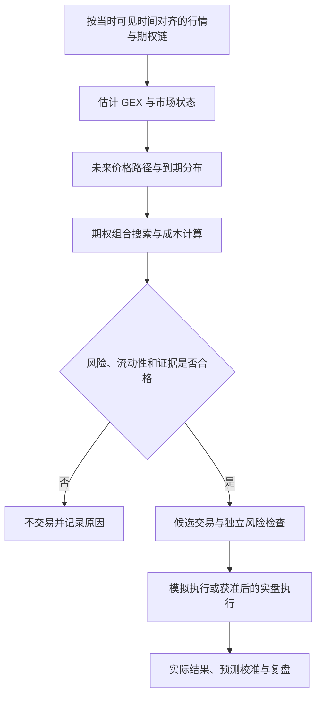

# SPX 期权组合研究：GEX、蒙特卡洛与蝶式优化

更新日期：2026-09-15。状态：**待验证的研究方案，尚未形成可执行的盈利结论。**

本文整理用户提供的“非线性动力学 + 蒙特卡洛模拟 + 蝶式期权优化”文本及其分析。原文包含一份复现设想和一份对该设想的修正意见；本文合并其有效内容，明确假设、数学边界和验证要求。

本文未运行策略回测、采购数据或接入交易执行。没有博主的原始模型、代码、参数及完整交易记录，不能将该方案称为对其系统的完整复现。下文的工作流和模块均为研究建议，不代表仓库已经实现这些能力。

## 1. 总体结论

这套体系希望完成四件事：

1. 从期权持仓、成交和报价中提取市场状态信息。
2. 估计未来价格路径与到期结算值的概率分布。
3. 按真实成交成本，选择与该分布匹配的期权组合。
4. 用风险预算和固定规则约束交易执行。

**其研究价值在于：检验额外数据和预测模型能否改善期权结构选择。** 目前没有证据证明“正 Gamma 环境下持续做蝶式即可稳定盈利”，也没有证据支持稳定月收益 5% 等目标。

需要分别验证三个命题：

| 命题 | 当前判断 |
| --- | --- |
| 某些期权组合可以预先确定到期盈亏边界 | 成立，但取决于具体结构、成交成本、合约条款及持仓是否保持完整 |
| GEX 可以提高未来价格分布的预测质量 | 待验证，不能从公开 OI 或成交量直接推出 |
| 更好的预测可以在成本后产生稳定的交易优势 | 待验证，需要账户回测、样本外检验和后续实际成交验证 |

单笔损失有上限、模型估计胜率较高、全年账户有正收益，是三个不同结论。

## 2. 原文提出的系统

### 2.1 工作链路



| 模块 | 输入与用途 | 应输出什么 |
| --- | --- | --- |
| 数据层 | SPX/SPY、期权链、OI、成交、Bid/Ask、IV、Greeks | 带时间戳、来源和质量标记的数据 |
| 仓位估计 | 持仓假设、OI、Gamma、可获得的交易方向信息 | 按行权价和到期日拆分的估计敞口，以及假设敏感性 |
| 市场状态 | 波动、成交、价格位置、估计敞口 | 震荡、趋势扩张或过渡状态的概率 |
| 随机模拟 | 校准后的价格过程与参数 | 到期分布、路径事件概率、尾部情景 |
| 结构搜索 | 分布、真实报价、合约条款、账户预算 | 成本后收益、盈利概率、最大损失和成交约束 |
| 执行与记录 | 通过检查的候选、账户状态 | 订单状态、成交、拒绝原因、风险占用和净值变化 |

### 2.2 原文两部分的区别

前半部分把“正 Gamma 形成收敛井、负 Gamma 造成发散”作为交易机制，并提出固定时段运行模拟和建仓。后半部分开始质疑这些假设，要求进行概率校准、基准比较和实际成本检验。

后半部分的研究方法更合理，但仍有遗漏：真实概率与定价概率的区别、破翅蝶式的双侧风险、离散结构搜索的性质，以及大量候选筛选带来的高估偏差。

## 3. 已核查的事实与需要纠正的说法

### 3.1 OI 和成交量不能直接还原做市商净 Gamma

OI 表示尚未结清的合约数量，不直接说明谁持有多头、谁持有空头。成交量还包含开仓、平仓、反向交易和组合交易，不能直接视为新增同方向持仓。

普通期权的 Gamma 符号由持仓方向决定：

- 买入 Call、买入 Put：正 Gamma。
- 卖出 Call、卖出 Put：负 Gamma。

因此，原文将 Call 项相加、Put 项相减，只能代表某种额外的持仓方向假设，不能视为真实做市商敞口的通用公式。其“客户买入价外期权、做市商在另一边卖出”的假设，也没有自然导出“Call 正、Put 负”。参见 [OIC：Gamma](https://prd-web.optionseducation.org/advancedconcepts/gamma)。

Cboe 在一项历史分析中指出，某行权价成交超过 10 万张，但做市商最终净空仓约 3,000 张。该例说明总成交量与净风险敞口可以相差很大，不证明所有时段都不存在对冲影响。参见 [Cboe：SPX 0DTE 市场影响分析](https://www.cboe.com/insights/posts/volatility-insights-evaluating-the-market-impact-of-spx-0-dte-options)。

研究实现应当：

1. 将指标命名为“估计做市商 Gamma 敞口”，记录方向假设。
2. 比较不同持仓方向假设下，信号是否仍然成立。
3. 明确计算单位、合约乘数和归一化方式。
4. 将 Call Wall、Put Wall、Gamma Flip 作为待验证特征，避免直接标注为确定的支撑、阻力或防线。

例如，若采用“标的变化 1% 对应的 Delta 敞口名义金额变化”这一口径，可写为：

```text
GEX_1pct = 0.01 × S² × Σ(q_i × M_i × Gamma_i)
```

其中，`q_i` 是带正负号的净持仓张数，`M_i` 是合约乘数，`Gamma_i` 是每单位标的价格变化对应的 Delta 变化。用于对冲的交易方向与敞口变化相反。公开 OI 不能直接充当真实的 `q_i`；上述公式用于澄清单位，不会解决持仓不可观测的问题。

### 3.2 Gamma 对冲不等于把价格拉回固定中心

原文采用类似下式的过程：

```text
dS = -κ × sign(GEX) × (S - Center) × dt + σ × S × dW
```

在正 Gamma 情景下，这个方程已经把“价格回到 Center”写进假设。模拟中出现大量回归路径，只说明计算服从模型设定，不能独立证明市场存在该回归机制。

做市商正 Gamma 对冲可能抑制价格运动；但“抑制运动”不等于“回到某个特定行权价”。还需检验：

- 中心位置如何确定，是否使用了未来数据。
- 回归强度 `κ` 如何估计，是否跨时段稳定。
- GEX 是解释波动幅度，还是能解释价格方向或回归位置。
- 将 GEX 加入模型后，是否优于只用价格与波动特征的基准。

价格运动、敞口变化、对冲交易与流动性之间可能存在反馈；“收敛井”“防守墙”等比喻不能替代可验证的因果证据。

### 3.3 市场隐含概率与真实发生概率必须区分

期权价格包含对未来状态的判断，也包含风险补偿。从期权价格推导出的风险中性分布，不能直接当作真实世界的发生频率。参见 [美联储：衍生品隐含概率与实际概率](https://www.federalreserve.gov/econres/ifdp/files/ifdp1294.pdf)。

系统必须明确：

| 对象 | 用途 | 不能直接推出什么 |
| --- | --- | --- |
| 风险中性分布 | 解释、拟合期权市场定价 | 真实胜率和现实中的预期交易利润 |
| 真实概率分布的估计 | 预测未来结果，评价交易收益 | 必然准确的未来结果 |
| 模型情景分布 | 压力测试和敏感性分析 | 情景发生的客观频率 |

如果仅从当前期权价格构建分布，再据此发现同一批期权“有很高正期望”，需要排查定价误差、采样误差、折现和成本口径。应说明新增预测信息来自哪里，并在样本外检验其价值。

### 3.4 数据描述中的错误与边界

| 原文说法 | 修正 |
| --- | --- |
| 必须采购 OPRA L2/L3 | OPRA 汇总成交和报价，与交易所深度订单簿是不同产品；不能混称，也不必在研究初期采购全市场深度数据 |
| 0DTE 开盘时持仓为零 | 0DTE 表示当天到期；合约可能提前上市并积累隔夜持仓 |
| OI 不变，所以 GEX 大底盘大部分时间固定 | 即使 OI 没更新，标的价格、时间与 IV 变化也会改变 Gamma；原文“80%”没有给出证据 |
| VIX 是“全月预期”，VIX1D 就是当天 0DTE | VIX 对应恒定 30 天预期波动；VIX1D 对应 1 天，并使用相应短到期合约按方法加权 |
| SPX 现货 TAQ 可以直接识别对冲成交 | SPX 是指数，本身没有股票式成交订单簿；SPY、指数期货及成分股数据是不同观测对象，也不能仅凭成交方向确认做市商身份 |
| 做 1～3 天策略，15 分钟延时完全够用 | 离线研究可不订阅实时流；实际筛选和下单仍需足够新鲜的报价，是否容忍延时应做敏感性测试 |
| IV、Greeks 都是交易所直接提供的真实量 | 很多数据源的 IV、Greeks 是计算结果，应保存模型、输入和时间戳，不能混用口径 |
| 几美元或几十美元即可满足数据需要 | 原文没有给出可核验套餐；覆盖范围、历史深度、并发、授权和实时指数行情需分别确认 |

来源：[OPRA 官方说明](https://www.opraplan.com/)、[Cboe 组合订单簿与深度行情](https://www.cboe.com/document/tech-spec/document/technical-specifications/cboe-titanium-u.s.-options-complex-book-process)、[Cboe：0DTE 定义与提前上市](https://www.cboe.com/insights/posts/debunking-options-myths)、[Cboe：VIX 与 VIX1D](https://www.cboe.com/insights/posts/what-the-vix-and-vix-1-d-indices-attempt-to-measure-and-how-they-differ)。

## 4. 蒙特卡洛模拟应回答什么

### 4.1 路径数量不能替代预测验证

6,000 条路径只是计算配置。固定模型下，增加独立路径通常降低抽样误差，不会修复错误的漂移、波动或跳跃假设。

假设独立路径给出的事件概率为 70%，路径数为 6,000：

```text
标准误差 ≈ sqrt(0.7 × 0.3 / 6000) ≈ 0.59 个百分点
近似 95% 抽样误差范围 ≈ 70% ± 1.16 个百分点
```

这只衡量模拟抽样误差，不包含参数估计、模型选择和市场变化带来的误差。

不同路径数量下结果变化较大，应分别检查随机种子、采样精度、程序实现、时间步长和输入变化。不能仅凭结果变化就认定“市场模型本身不稳定”。

### 4.2 区分三个事件

| 事件 | 所需计算 |
| --- | --- |
| 盘中是否触碰某点位 | 路径事件，需要明确触碰、跨越及观测频率的定义 |
| 到期是否落入盈利区间 | 终端结算值与完整组合盈亏函数 |
| 账户是否出现某幅度回撤 | 所有仓位、交易顺序、持仓估值和出入金调整后的净值路径 |

触碰中心行权价不代表蝶式已经达到到期最大盈利。提前平仓还需要相应时点的期权估值和可成交价格。

一分钟离散采样可能漏掉采样点之间的触碰。若模型带跳跃，`min(path) ≤ K ≤ max(path)` 可以表示价格跨越过该水平，但不保证实际在该价格发生触碰或成交；需按策略的事件定义实现。

价格路径的 68% 或 95% 分位数范围，应称为模型预测区间，不应与参数估计的置信区间混为一谈。

### 4.3 校准与基准比较

应在未参与拟合的数据上检验：

- 预测约 70% 概率的事件，实际发生比例是否接近 70%。
- 预测区间的覆盖率、宽度和尾部漏报情况。
- Brier Score、Log Loss 等概率误差指标。
- 相对简单基准是否有增量价值，而非仅仅“概率看起来合理”。

总是给出很宽的区间，也可能获得很高覆盖率；因此覆盖率与区间宽度需要一起评价。

## 5. 期权结构与风险计算

以下示例均假设同一标的、同一到期日、每点 100 美元，完整持有至正常到期结算，不计手续费、融资和其他成本。SPX/SPXW 与 SPY 的合约条款应分别建模。SPX 采用欧式行权和现金结算，不能照搬美式股票期权的交割逻辑。参见 [Cboe：SPX 产品说明](https://www.cboe.com/tradable-products/sp-500/spx-options)。

### 5.1 对称看涨蝶式

```text
买入 1 张 7590 Call
卖出 2 张 7625 Call
买入 1 张 7660 Call
净支出：615 美元（此前截图中的示例）
```

| 指标 | 结果 |
| --- | ---: |
| 最大损失 | 615 美元 |
| 最大盈利 | 2,885 美元 |
| 盈亏平衡点 | 7,596.15、7,653.85 |
| 最大盈利对应结算值 | 7,625 |
| 最大损失对应结算值 | ≤7,590 或 ≥7,660 |

到期最大盈利等于单侧宽度乘以乘数，再减净支出；最大损失等于净支出。参见 [OIC：Long Call Butterfly](https://prd-web.optionseducation.org/strategies/all-strategies/long-call-butterfly)。

### 5.2 原文中的破翅蝶式

```text
买入 1 张 7600 Call
卖出 2 张 7625 Call
买入 1 张 7675 Call
净支出：D 美元
```

下侧宽 25 点，上侧宽 50 点。若 `D > 0`：

| 到期结算值 | 组合损益 |
| --- | --- |
| ≤7,600 | `-D` |
| 7,625 | `2,500 - D`，为最大盈利位置 |
| ≥7,675 | `-2,500 - D`，为最大损失 |

如果净支出假设为 500 美元，则最大盈利为 2,000 美元，下方最大损失为 500 美元，上方最大损失为 **3,000 美元**。

因此，“蝶式最多亏净权利金”不能无条件推广到破翅结构。若净收权利金，也应重新计算各区间损益，不能直接套用上述净支出情景。

### 5.3 扩大盈利区间的取舍

可以通过拆开中间卖出行权价，形成看涨鹰式，在一段区间达到最大盈利。也可以研究不同宽度、到期日和其他有损失上限的结构。调整后必须同时重新计算：

- 实际净成本和最大盈利。
- 双侧最大损失与盈利区间。
- 估计盈利概率及平均盈利、平均亏损。
- 账户风险占用和成交成本。

更宽的盈利区间不自动意味着更小的资金损失；降低单组风险后增加组数，也可能提高账户总风险。参见 [OIC：Long Call Condor](https://prd-web.optionseducation.org/strategies/all-strategies/long-call-condor)。

## 6. 结构优化应如何定义

### 6.1 首先使用明确的成本后损益

对每个候选组合，计算每条情景下的完整净损益：

```text
PnL_j = 组合结算额或退出所得
        - 开仓净支出
        - 交易费用
        - 已单独建模且未计入成交价的滑点
        - 融资等适用成本

EV = Σ(p_j × PnL_j)
POP = Σ(p_j × I[PnL_j > 0])
```

净收权利金可按负的净支出处理。不得重复计算已包含在成交价中的价差或滑点。概率用于交易期望收益时，应明确其真实概率估计口径。

提前退出策略不能只使用到期分布，必须建模退出时点、期权价格和成交条件。

### 6.2 离散搜索与约束

行权价、到期日和张数是离散选择，盈利概率约束也不必然是凸约束。首版宜称为“候选结构搜索器”，不预设已有标准凸优化解法。

优先使用明确约束：

1. 单笔及账户合计的最大潜在损失预算。
2. 合约可交易性、报价新鲜度、流动性与订单规模。
3. 成本后收益与风险要求。
4. 同标的、相邻到期日及相同中心位置的集中度限制。
5. 允许“不交易”，避免强制挑选当前最优但仍不合格的组合。

`POP ≥ 70%` 是偏好约束，不是盈利保证。简单将美元 EV、百分比胜率、赔率和尾部损失相加，会混用量纲；若使用综合评分，应定义归一化、权重来源和稳健性检验。

### 6.3 防止搜索放大模型误差

从上万个候选中选出最高估计 EV，容易选中被误差高估最多的结构。应记录搜索空间，并检验：

- 更换随机种子、稍微改变波动与漂移，候选是否仍然合格。
- 使用更保守成交成本后，优势是否消失。
- 临近行权价结构是否给出相近结论。
- 选择规则在新的时间区间是否仍然有效。

不能因为优化器给出一个最大值，就认为它找到了市场中的稳定优势。

## 7. 数据与回测的最低要求

首阶段聚焦一个标的和明确的预测时点，无需预先采购全美股所有期权深度数据。最低数据范围应由实验定义决定。

| 数据 | 要求 |
| --- | --- |
| 标的行情 | 明确 SPX 指数、SPY ETF 或期货，各自的时间和交易时段 |
| 期权合约信息 | 行权价、到期日、乘数、行权方式、结算类型和结算时点 |
| 历史报价 | 决策时点可见的 Bid/Ask、数量、时间戳和缺失标记 |
| OI 与成交 | 保存发布时点，区分日终 OI 和盘中成交量 |
| IV 与 Greeks | 保存来源、计算方法和对应行情时点 |
| 波动与事件 | 期限匹配的波动特征、隔夜风险、已知重要事件时间 |
| 执行与净值 | 成交、费用、撤单、资金占用、持仓估值和出入金 |

关键规则：

- 历史数据可以离线读取，但必须还原“当时已经知道什么”。
- 不能用收盘后数据替当天 15:40 的决策提供信息。
- 原文的 0DTE 尾盘交易和 1DTE 次日到期交易是不同实验，需分开处理剩余时间、隔夜波动和结算。
- 若研究一分钟触碰或盘中退出，只有日线或日终期权切片不足以验证执行过程。
- 不能把所有组合默认按各腿中间价成交；组合限价单也不保证成交。
- 数据源价格、授权范围和 API 限制在采购前另行核实，不使用原文的费用估计直接编制预算。

## 8. 建议的最小研究版本与推进标准

以下阶段均为待开展工作。

### 阶段 A：基准与数据审计

固定一个标的、到期范围、决策时点、退出规则和资金预算。先建立不依赖 GEX 的简单分布模型，以及固定规则的蝶式或鹰式基准。

交付物：数据覆盖报告、时点审计、基准预测、基准组合和成本假设。

### 阶段 B：验证 GEX 的增量信息

比较相同数据、相同时间范围下的模型：

| 对照 | 内容 |
| --- | --- |
| 基准模型 | 价格、历史波动、期限匹配的隐含波动与时间特征 |
| 增强模型 | 在基准上增加估计 GEX、行权价位置和状态特征 |

检查概率校准、区间宽度、尾部覆盖及适用市场状态。若 GEX 没有稳定增益，可以移除该模块；这并不证明所有期权组合策略都无效。

### 阶段 C：检验结构选择与账户收益

将各模型分别接入相同的结构搜索和执行规则，比较成本后账户结果。至少记录：

- 单笔平均净收益、胜率、平均盈利和平均亏损。
- 账户收益、最大回撤、回撤恢复时间及资金利用。
- 连续亏损、集中亏损和不同市场状态下的表现。
- 利润是否依赖极少数交易、日期或参数组合。
- 相同风险预算下，相对固定规则基准的差异。

至少一年的数据可以用于初步研究，但一年本身不是充分证据。应覆盖不同市场状态，按时间划分拟合、验证与保留测试区间；重叠交易标签需避免泄漏，重复观察历史也会削弱独立性。

### 阶段 D：前向模拟与执行验证

冻结版本，在新数据上持续生成不可事后改写的预测和候选，记录可成交报价及模拟结果。然后再评估是否具备小规模实盘验证条件。

推进依据不能是“五项有三四项通过”。以下条件应分别满足：

1. 数据和回测没有已知的关键时点错误。
2. 成本后收益证据足够支持下一阶段，且对合理参数与成本变化不过度敏感。
3. 账户风险、资金和订单约束可执行。
4. 拟采用的预测模块优于适当基准，或已被移除。
5. 结果可重现，前向记录与研究结果的差异有解释。

## 9. Agent 的职责边界

### 研究模块

负责提出待检验假设、编写和执行实验、审计数据、生成报告、记录失败结果及保存模型版本。它输出研究结论和候选，不把模型预测直接当作交易授权。

### 执行模块

只处理固定版本的规则、当前可见数据和账户状态。风险检查应由确定性的程序执行，涵盖：

- 全部持仓和新订单合并后的风险占用。
- 重复下单、部分成交、撤单失败和状态同步。
- 报价过期、数据断流、异常价格和交易时段。
- 组合腿完整性、现金或保证金要求。
- 停止新增风险的条件与人工处理入口。

LLM 可以解释结果、协助研究和提出候选；不应依靠其自然语言判断来替代损失上限、账户额度或订单一致性检查。停止开新仓也不代表已有持仓的损失已经消失。

## 10. 如何理解“风险可控”和“稳定赚钱”

风险至少需要分成三层：

1. **合约层**：这一笔完整结构的到期最大损失。
2. **账户层**：多笔持仓同时亏损、连续开仓亏损和浮盈回吐造成的回撤。
3. **模型层**：概率误估、参数失效和执行成本变化。

例如，每笔最多承担当时账户净值的 2%，若连续 10 次都达到最大损失，账户累计损失约为 18.3%；连续 20 次约为 33.2%。这只是复利计算情景，不代表对连亏概率的预测。

先前的持仓截图和约两个月收益曲线，只能用于理解组合和提出研究问题，不能替代完整账户记录。单笔组合收益率、账户收益率、已实现盈利和未实现浮盈必须分别记录。

**最终判断标准：在相同账户风险预算下，加入这些数据、模型和搜索步骤，能否在实际成本后稳定改善简单基准的结果。** 如果不能，保留更简单的规则或不交易，都是合格的研究结论。
